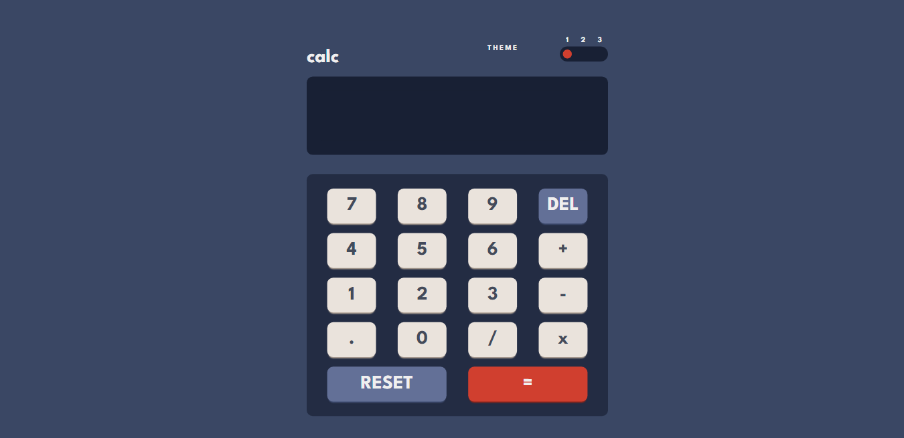

# Frontend Mentor - Calculator app solution

This is a solution to the [Calculator app challenge on Frontend Mentor](https://www.frontendmentor.io/challenges/calculator-app-9lteq5N29). Frontend Mentor challenges help you improve your coding skills by building realistic projects. 

## Table of contents

- [Overview](#overview)
  - [The challenge](#the-challenge)
  - [Screenshot](#screenshot)
  - [Links](#links)
- [My process](#my-process)
  - [Built with](#built-with)
  - [What I learned](#what-i-learned)
  - [Useful resources](#useful-resources)
- [Author](#author)

## Overview

### The challenge

Users should be able to:

- See the size of the elements adjust based on their device's screen size
- Perform mathmatical operations like addition, subtraction, multiplication, and division
- Adjust the color theme based on their preference
- **Bonus**: Have their initial theme preference checked using `prefers-color-scheme` and have any additional changes saved in the browser

### Screenshot



### Links

- Solution URL: [https://github.com/husnain214/calculator-app]
- Live Site URL: [https://husnain214.github.io/calculator-app/]

## My process

### Built with

- Semantic HTML5 markup
- CSS custom properties
- Flexbox
- CSS Grid
- Desktop-first workflow

### What I learned

I learned to use HTML inputs as CSS click event listeners and also learned about sibling selector.

```CSS
input[type="radio"] {
  opacity: 0;
  cursor: pointer;
}

#theme1:checked ~ .circle {
  top: 17%;
  transform: translateX(5px);
}

#theme2:checked ~ .circle {
  top: 17%;
  transform: translateX(33px);
}

#theme3:checked ~ .circle {
  top: 17%;
  transform: translateX(60px);
}
```
Also this was the first time I used Switch statement in Javascript which I think made my code cleaner than it would have been with IF ELSE statements. Also I finally got to use an event listener that was not click.

```JS
document.body.addEventListener("keydown", e => {
    switch (e.key) {
        case "0":
        case "1":
        case "2":
        case "3":
        case "4":
        case "5":
        case "6":
        case "7":
        case "8":
        case "9":
        case "*":
        case "+":
        case "/":
        case "-":
        case "x":
            output.value += e.key;

            mathExpression += (e.key === "x") ? "*" : e.key;

            break;
        case "Backspace":
            output.value = output.value.slice (0, output.value.length - 1)
            mathExpression = mathExpression.slice (0, mathExpression.length - 1)

            break;
        case "=":
            output.value = eval (mathExpression)

            break;
        default:
            alert ("Invalid Input!")
    }
})
```

### Useful resources

- [Online Tutorials' Toggle Button tutorial](https://www.youtube.com/watch?v=uCjDIMADK0w) - This helped me learn how convenient HTML inputs are compared to event listeners sometimes.

## Author

- Website - [Husnain Zahid](https://fantastic-khapse-2cca16.netlify.app/)
- Frontend Mentor - [@husnain214](https://www.frontendmentor.io/profile/husnain214)
- Twitter - [@husnain_dbz214](https://twitter.com/husnain_dbz214)
